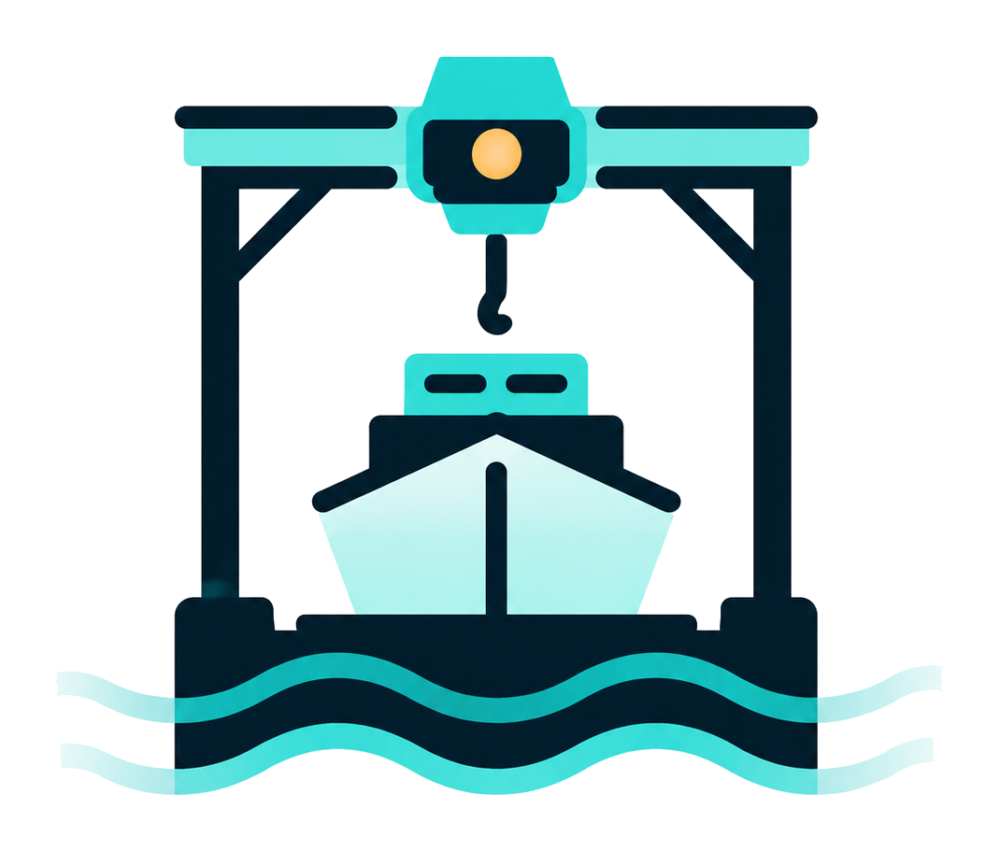

<p align="center">
  
</p>

<h1 align="center">Dockyard</h1>

<p align="center">
  <em>The paved road for production-grade MCP Apps.</em>
</p>

<p align="center">
  Portico connects · Harbor reasons · <strong>Dockyard presents</strong>.
</p>

---

Dockyard is a Go-native framework for building **MCP servers and MCP Apps** —
the side an agent's user actually sees. You write typed Go tool handlers. The
toolchain generates the JSON Schema, the TypeScript types, the fixtures, and a
local inspector that renders your App against a real running server. One
command produces a CGo-free static binary with the UI embedded.

It's opinionated on purpose. Every MCP App project gets the same set of paved
roads — contract-first codegen, an observability protocol the runtime emits
natively, a sandboxed-iframe App bridge with explicit CSP, MCP Tasks with
`input_required` elicitation, a dev loop with one process tree — so the
interesting work is the App, not the plumbing.

## What it looks like

The two V1 templates ship as real, runnable proofs: `analytics-widgets` (a
chart + table + metric-card pack) and `approval-flows` (human-in-the-loop
approve/edit with MCP Tasks). Both render in the local inspector against a
scaffolded server:

<table>
<tr>
  <td align="center" width="50%">
    
    <sub><code>create_chart</code> — happy fixture, rendered live</sub>
  </td>
  <td align="center" width="50%">
    
    <sub><code>request_approval</code> — full input_required lifecycle</sub>
  </td>
</tr>
</table>

The inspector isn't a separate tool you run alongside development — it's the
debug surface: rail tabs for the live `obs/v1` stream, the JSON-RPC log,
fixtures wired to the generated contracts (so the App's six UI states are
exercisable before a backend exists), per-tool latency / error analytics,
contract-drift verdicts, the task lifecycle as a Timeline. Operator
parameter-driven tool invocation is one click away.

## Try it

The recommended path post-v1.0.0 is one command:

```sh
go install github.com/hurtener/dockyard/cmd/dockyard@v1.0.0
dockyard --help
```

`go install` resolves the tag against the Go module proxy and produces
a working `dockyard` binary at `"$(go env GOPATH)/bin/dockyard"` (add
that to `PATH` if it isn't already). The build is CGo-free; the binary
is the same artifact the release pipeline cross-compiles for darwin,
linux, and windows × amd64 and arm64. Verify with the `.sha256` sidecar
on the [Releases page](https://github.com/hurtener/dockyard/releases).

Then scaffold + run a real, working example:

```sh
dockyard new --template analytics-widgets ~/widgets-demo
cd ~/widgets-demo
go mod tidy                                   # one-time, populates go.sum
dockyard generate
dockyard build

# in one terminal: serve over HTTP
DOCKYARD_TRANSPORT=http DOCKYARD_HTTP_ADDR=127.0.0.1:8080 ./bin/widgets-demo

# in another terminal: attach the inspector
dockyard inspect --url http://127.0.0.1:8080/mcp --dir .
```

### Build from source

You can also build the CLI from this repo and point a new project at it
via `--dockyard-path`. Useful if you're hacking on Dockyard itself or
want to run against `main`:

```sh
git clone https://github.com/hurtener/dockyard
cd dockyard
make build                            # produces ./bin/dockyard, CGo-free

./bin/dockyard new --template analytics-widgets ~/widgets-demo \
    --dockyard-path "$(pwd)"
cd ~/widgets-demo
go mod tidy                           # one-time, pre-publish workflow (D-139)
"$(pwd | sed 's|/widgets-demo||')/dockyard/bin/dockyard" generate
"$(pwd | sed 's|/widgets-demo||')/dockyard/bin/dockyard" build
```

The full walkthrough — with the second template, the dev loop, contract-first
authoring, and the inspector's deeper features — lives in the docs site (see
below). The `scaffold-a-server` agent skill in [`skills/`](skills/) covers the
same ground for AI coding agents.

## What's shipped

| | Status |
| --- | --- |
| **MCP server core** — transports (stdio + streamable HTTP), the explicit `HTTPSecurity` posture, the typed handler runtime with panic guards | ✅ |
| **Contract-first codegen** — Go struct → JSON Schema + TypeScript; `dockyard validate` fails on drift | ✅ |
| **MCP Apps extension** — `ui://` resources, `//go:embed` pipeline, host profiles (Claude signed-origin derivation), Svelte bridge | ✅ |
| **MCP Tasks extension** — five-state lifecycle, durable `TaskStore`, `TaskHandle` API, `input_required` elicitation, real transport mount | ✅ |
| **Observability protocol** (`obs/v1`) — non-blocking emitter, ring buffer, out-of-band SSE sink, optional OTel adapter, log bridge | ✅ |
| **`dockyard` CLI** — `new`, `generate`, `validate`, `build`, `run`, `install`, `dev`, `test`, `inspect` | ✅ |
| **Local inspector** — App preview, live obs stream, JSON-RPC log, fixtures, operator tool invocation, capability emulation, task lifecycle | ✅ |
| **Two V1 templates** — `analytics-widgets`, `approval-flows` | ✅ |
| **Shared design system** (`web/ui/`) — typed Svelte component inventory, design tokens, four-state PageState rule | ✅ |
| **Agent skills + published docs site** — `SKILL.md`-format onboarding, VitePress site deployed by CI | ✅ |
| **Security pass + spec-compliance conformance** | ✅ |
| **V1 cut** — `CHANGELOG.md`, release pipeline, V2 backlog, RELEASING.md | ✅ |

The full phase plan is in [`docs/plans/README.md`](docs/plans/README.md);
settled architectural decisions are append-only in
[`docs/decisions.md`](docs/decisions.md); the post-V1 backlog
(what's deferred, what comes next) is consolidated in
[`docs/V2-BACKLOG.md`](docs/V2-BACKLOG.md).

## The four properties

Four things are non-negotiable across the build. They're enforced in code, not
just claimed in prose:

1. **Contract-first.** A tool's input and output are typed Go structs. JSON
   Schema, TypeScript types, and fixtures are *generated*. `dockyard validate`
   fails on stale or drifted generated output. There is no hand-written
   contract schema anywhere in the repo and no PR that introduces one will
   merge.
2. **Observability is a protocol.** The runtime emits the canonical `obs/v1`
   event stream. The inspector is a pure client of that contract; no component
   reads runtime internals to observe. OpenTelemetry export is an optional
   adapter, off by default — never a prerequisite to see what your server is
   doing.
3. **Forward-compatibility by isolation.** MCP extension wire formats live in
   exactly one package (`internal/protocolcodec`). A spec bump is a vendored-
   snapshot update + a regenerate-and-diff in that package; handler-facing and
   manifest-facing APIs never see a raw protocol struct. A boundary test walks
   the whole module to enforce it.
4. **Server-side only.** Dockyard builds MCP *servers* and Apps. Harbor owns
   the MCP client. The one client-shaped component — the inspector — is a
   local, dev-mode-gated, localhost-bound test surface; it refuses any non-
   loopback bind before the listener opens. There is no production MCP client
   in the shipped artifact.

## The ecosystem

Dockyard is the third product in a three-part agent platform:

```text
Portico  — the MCP gateway        (connects and governs tools)
Harbor   — the agent framework    (builds and runs agents; owns the MCP client)
Dockyard — the MCP Apps framework (builds the MCP servers and apps users touch)
```

The split keeps responsibilities sharp: Portico is the network seam, Harbor
owns the agent loop, Dockyard owns the experience your users actually touch.
Each one is usable independently; together they're the paved-road production
stack.

## Repository map

| Path | What lives here |
| --- | --- |
| `RFC-001-Dockyard.md` | The design source of truth — re-read it before you propose a structural change. |
| `cmd/dockyard/` | The `dockyard` CLI binary entrypoint. |
| `internal/` | CLI and generator internals (cobra tree, scaffold, codegen, validate, devloop, inspector, build/run/install pipelines, the `protocolcodec` extension seam). |
| `runtime/` | The runtime library a generated server imports (server core, tool handler runtime, Apps, Tasks, obs, store). |
| `web/` | The shared frontend: `ui/` (the design system), `bridge/` (the `ui/` postMessage View half), `inspector/` (the inspector's Svelte app). |
| `templates/` | The two V1 templates, embedded into the CLI. |
| `skills/` | Agent skills in the `SKILL.md` format — onboarding for AI coding agents. |
| `docs/site/` | The VitePress docs site sources (built and deployed to GitHub Pages by CI). |
| `docs/plans/`, `docs/research/`, `docs/decisions.md`, `docs/glossary.md` | The doc-driven build artifacts — phase plans, research briefs, the append-only decision log, the vocabulary. |
| `AGENTS.md` / `CLAUDE.md` | Contributor & agent normatives (binding, kept verbatim-identical). |

## Documentation

- **Docs site** — getting started, the CLI reference (auto-rendered from the
  cobra command tree), the agent skills index, the RFC, the decisions log:
  https://hurtener.github.io/dockyard/ *(deploys on `main` push)*
- **Agent skills** — `skills/` ships eight `SKILL.md` files (`scaffold-a-server`,
  `add-a-tool`, `attach-a-ui-resource`, `define-contracts`, `run-the-dev-loop`,
  `validate`, `package`, `test-with-the-inspector`) so an AI coding agent is
  productive with Dockyard from day one.
- **Release notes** — every release's notes are in
  [`CHANGELOG.md`](CHANGELOG.md) and on the
  [Releases page](https://github.com/hurtener/dockyard/releases). The release
  procedure for maintainers is in [`docs/RELEASING.md`](docs/RELEASING.md).

## Contributing

[`AGENTS.md`](AGENTS.md) is binding for anyone — human or AI — modifying this
repository. Build, test, and lint via the `Makefile` (`make help`); the
`make preflight` gate runs in CI and as a pre-commit hook
(`make install-hooks`).

The project uses a doc-driven methodology — research briefs → RFC → master
phase plan → phased implementation. Every architectural decision lands in
`docs/decisions.md` with a number; that log is the institutional memory.

## License

[Apache-2.0](LICENSE).
