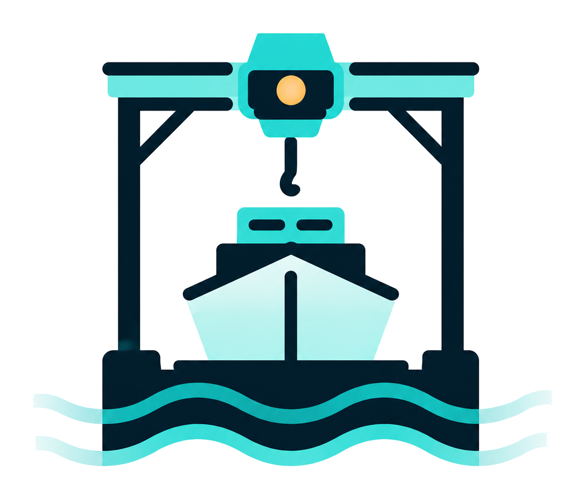
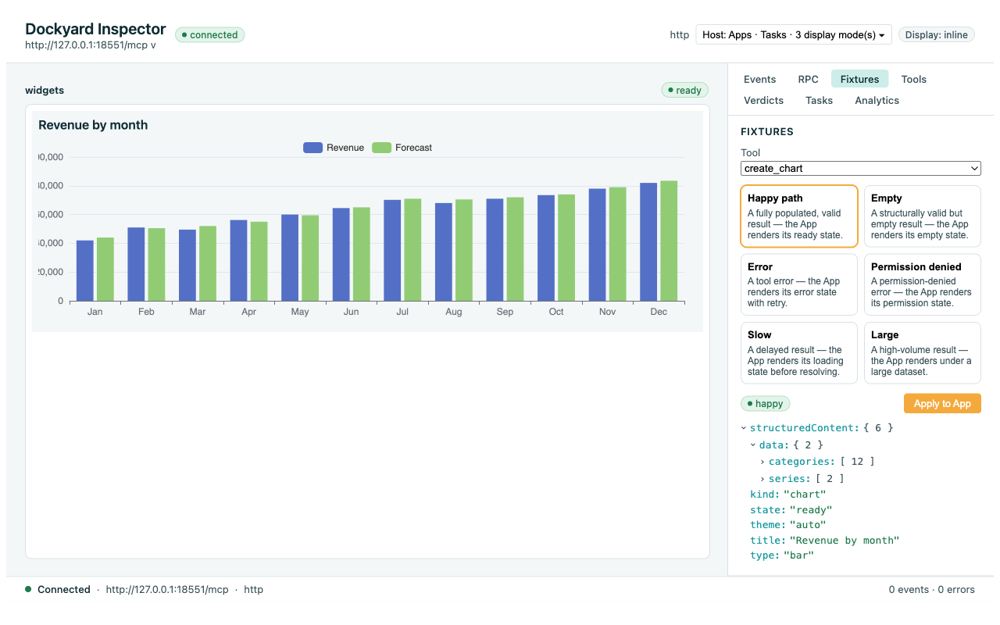
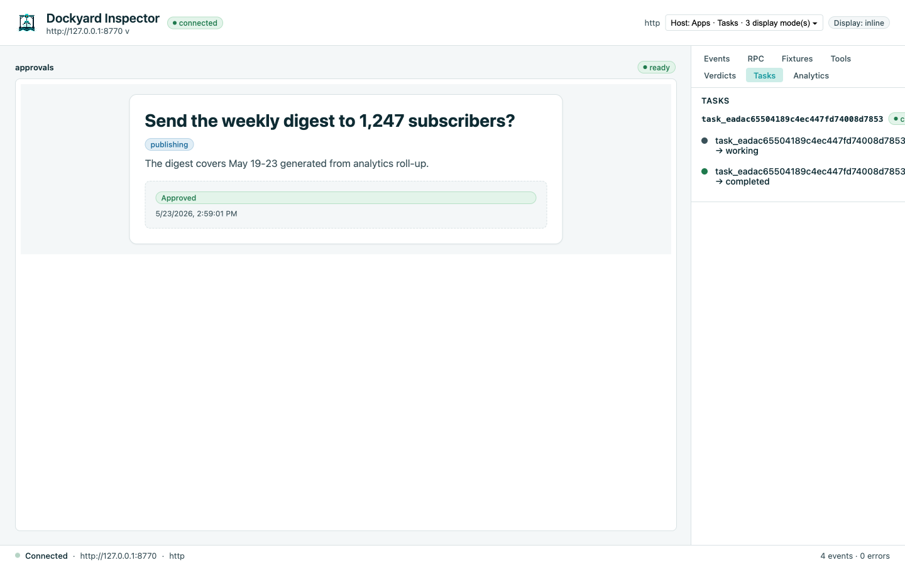

<p align="center">
  
</p>

<h1 align="center">Dockyard</h1>

<p align="center">
  <strong>Build production MCP Servers and MCP Apps in Go.</strong>
</p>

<p align="center">
  Typed tools. Embedded UI. Local inspection. Observable by default. One static binary.
</p>

<p align="center">
  <a href="https://hurtener.github.io/dockyard/">Docs</a>
  ·
  <a href="#quickstart">Quickstart</a>
  ·
  <a href="#templates">Templates</a>
  ·
  <a href="#the-dockyard-loop">The Dockyard loop</a>
  ·
  <a href="#contributing">Contributing</a>
</p>

---

Dockyard is a Go-native framework for building MCP servers with rich, interactive
MCP Apps. It is for the moment when a tool stops being a demo and starts becoming
software: it needs typed contracts, UI states, fixtures, validation, observability,
packaging, and a way to debug the whole thing locally before a host ever renders it.

You write Go handlers and Svelte views. Dockyard generates the protocol contracts,
TypeScript types, fixtures, embedded UI resources, and local inspection surface
around them.

<p align="center">
  
</p>

<p align="center">
  <sub>The local inspector rendering a real <code>create_chart</code> call against a scaffolded MCP server.</sub>
</p>

## A Dockyard tool, in full

```go
type GetWeatherInput struct {
    City string `json:"city" jsonschema:"required"`
}

type GetWeatherOutput struct {
    Temperature float64 `json:"temperature"`
    Conditions  string  `json:"conditions"`
}

func GetWeather(ctx context.Context, in GetWeatherInput) (tool.Result[GetWeatherOutput], error) {
    // ...your code...
}
```

That struct pair is the source of truth. `dockyard generate` produces the JSON
Schema the host validates against, the TypeScript types the App consumes, and
the fixture scaffolds the inspector renders. `dockyard validate` fails if any of
them drift. You never hand-maintain a schema or a TypeScript shadow contract;
the toolchain does.

## Why Dockyard exists

MCP makes tools available to agents. MCP Apps make those tools visible to users.
That second part changes the job.

A useful App is not just a tool result with some HTML attached. It needs a
contract between the server and the UI. It needs loading, empty, error,
permission, slow, and large-data states. It needs fixtures so the App is
testable before the backend is finished. It needs safe iframe boundaries. It
needs host-compatibility. It needs a way to see what the server emitted and why
the UI rendered what it rendered.

Without a framework, every team rebuilds that plumbing differently — and most
teams ship the happy path first and learn the edge cases in production.

So Dockyard handles it for you:

- Go structs are the source of truth.
- JSON Schema and TypeScript types are generated.
- UI resources are embedded into the server binary.
- Apps render through a sandboxed bridge with deny-by-default CSP.
- Tasks and human-in-the-loop flows are first-class.
- The runtime emits **Logbook** — a native observability stream the inspector
  reads directly.
- The inspector debugs tools, fixtures, JSON-RPC, Tasks, and UI in one place.
- `dockyard validate` catches drift before users do.

The protocol is the foundation. Dockyard is the product layer above it.

## What you can build

```text
MCP server = tools + resources + prompts
MCP App    = server + ui:// views the host renders
MCP Tasks  = task-augmented tools, human-in-the-loop  (experimental spec)
```

Start with a server. Add a UI when the tool deserves one. Pause for user input
when a tool needs approval — Tasks is a first-class extension Dockyard already
supports end to end, with the caveat that the spec itself is still experimental
upstream. Ship all three shapes as the same single binary. Good fits include
analytics widgets, approval and review flows, internal business apps exposed
through MCP, dashboards inside chat, and any agent-facing tool that needs a
user-facing surface.

## Templates

Two ready-to-fork starting points covering both halves of MCP Apps — scaffold
one, run it, remix it into your own project:

<table>
<tr>
  <td width="50%" valign="top">
    <p align="center">
      
    </p>
    <h3 align="center"><code>analytics-widgets</code></h3>
    <p>The read-side template: charts, tables, and metric cards rendered
    inline in the host's chat. Exercises the contract-first path end to end —
    Go output → JSON Schema → TypeScript → fixtures → Svelte App → embedded
    <code>ui://</code> resource → inspector preview.</p>
    <p><em>Reach for it when the App is data-first.</em></p>
  </td>
  <td width="50%" valign="top">
    <p align="center">
      
    </p>
    <h3 align="center"><code>approval-flows</code></h3>
    <p>The write-side template: human-in-the-loop approve / reject / edit
    flows over MCP Tasks. Demonstrates the <code>input_required</code>
    lifecycle, editable proposals, and the task timeline rendered live in
    the inspector.</p>
    <p><em>Reach for it when a tool needs the user's go-ahead before acting.</em></p>
  </td>
</tr>
</table>

```bash
dockyard new --template analytics-widgets ~/my-widgets
dockyard new --template approval-flows    ~/my-approvals
```

## The Dockyard loop

**Scaffold + generate.** `dockyard new --template <name>` materialises a real
project with typed contracts, generated JSON Schema + TypeScript, fixtures, and
an embedded App. `dockyard generate` keeps the generated artifacts in sync as
the contracts evolve.

**Develop with the inspector.** `dockyard dev` runs the live-reload loop and
opens the local inspector. The inspector renders your App against the real
running server — not a mock viewer. Switch between fixture states, invoke tools
with operator-provided parameters, watch the Logbook stream, step through a
Task's `input_required` round-trip, and verify the App in its sandboxed iframe
before any host sees it.

**Validate + package.** `dockyard validate` catches contract drift, stale
generated files, missing UI states, unsafe App settings, and spec-compliance
issues — the failures users would otherwise hit. `dockyard build` produces a
single CGo-free Go binary with the UI embedded. The same artifact runs over
stdio, over HTTP, or wherever your transport story lands; the choice is at
runtime, not baked into the build.

## Quickstart

> Replace `@main` with `@v1.0.0` after the first release tag is published.

```bash
go install github.com/hurtener/dockyard/cmd/dockyard@main
dockyard --help
```

Scaffold and run the analytics template:

```bash
dockyard new --template analytics-widgets ~/widgets-demo
cd ~/widgets-demo
go mod tidy
dockyard generate
dockyard build
```

Serve the generated MCP server over HTTP and attach the inspector:

```bash
DOCKYARD_TRANSPORT=http \
DOCKYARD_HTTP_ADDR=127.0.0.1:8080 \
./bin/widgets-demo &

dockyard inspect \
  --url http://127.0.0.1:8080/mcp \
  --dir .
```

## Core ideas

**Contract-first.** A Dockyard tool starts with typed Go structs. Those structs
generate the JSON Schema the MCP host sees and the TypeScript types the App
uses. The UI does not hand-maintain a shadow contract. If generated output is
stale or drifted, validation fails before a build can ship.

**Apps are server resources.** Dockyard treats an MCP App as an MCP server with
one or more `ui://` resources. The UI is built, bundled, embedded, served
through `resources/read`, and linked to tools through App metadata. The App
runs in a sandboxed iframe behind a deny-by-default CSP and talks to the host
through the Dockyard bridge.

**Logbook — observability built in.** Every Dockyard server emits Logbook, a
canonical, versioned event stream covering tool calls, resource reads, App
lifecycle, Tasks transitions, prompt invocations, and server diagnostics. The
inspector is a Logbook client; the optional OpenTelemetry adapter is another
Logbook client. Understanding what your server is doing is not a separate tier
of the stack — it ships in the box, on by default, with W3C trace propagation
already wired so a calling agent's trace context flows through.

**Tasks are first-class.** Dockyard supports task-augmented tools and the
`input_required` lifecycle used by human-in-the-loop Apps. A tool can pause
for user input, render a form, resume from the iframe, and expose the whole
lifecycle to the inspector — without the developer hand-rolling the
elicitation choreography.

**One artifact.** A Dockyard project builds to a single static Go binary with
the UI embedded. No separate Node server. No runtime web-asset folder. No CGo
requirement. No separate frontend deploy just to render an MCP App.

## Where Dockyard fits

Dockyard is the server side of MCP. Not the agent loop, not the production
client, not a gateway, not a hosted cloud — those are different jobs, and
trying to do all of them would mean doing none of them well. The local
inspector is the one place Dockyard talks like a client, and it stays on your
laptop: it refuses any non-loopback bind before its listener opens, and it
only fires a state-changing call when you click one.

For the agent side, look at Harbor — Dockyard's sibling framework in the same
family.

## Documentation

The published documentation site covers getting started, the CLI reference
(auto-generated from the command tree), template walkthroughs, design
conventions, the agent skills, the RFC, the decisions log, and the glossary.

**Start here:** https://hurtener.github.io/dockyard/

## Build from source

To work from a local checkout (and to scaffold projects that reference your
working tree before the first published tag):

```bash
git clone https://github.com/hurtener/dockyard
cd dockyard
make build
./bin/dockyard --help
```

Use the local CLI to scaffold a project against your checkout:

```bash
./bin/dockyard new --template analytics-widgets ~/widgets-demo \
  --dockyard-path "$(pwd)"
cd ~/widgets-demo
go mod tidy
dockyard generate
dockyard build
```

## Contributing

Dockyard is built doc-first. Research briefs, RFCs, plans, and architectural
decisions live in the repository — if you change the framework shape, update
the design record with the code.

Before opening a PR:

```bash
make preflight
```

Human and AI contributors should read:

- [`AGENTS.md`](AGENTS.md)
- [`CLAUDE.md`](CLAUDE.md)
- [`RFC-001-Dockyard.md`](RFC-001-Dockyard.md)
- [`docs/decisions.md`](docs/decisions.md)

## License

[Apache-2.0](LICENSE).
